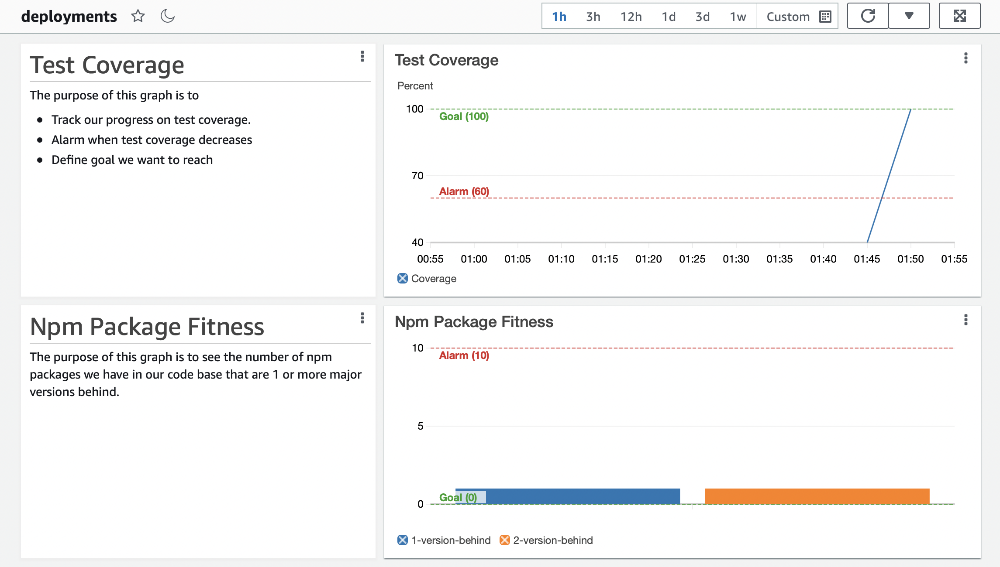

# Cloudwatch Jest Test Coverage

This is an example of record custom CloudWatch metrics on every successful jest
test run, allowing your team to graph test coverage progress and alarm when test coverage
goes below a certain threshold.

